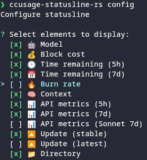

# ccusage-statusline-rs

Ultra-fast Rust implementation of Claude Code usage statusline.


## Description

High-performance statusline for Claude Code that displays real-time usage metrics, billing blocks, and burn rates. Written in Rust for sub-millisecond response times with intelligent caching.

## Features

- **Ultra-fast performance** - 15x faster than Node.js implementation (8ms vs 120ms warm)
- **Live API integration** - Real-time 5-hour and 7-day utilization via Claude Code OAuth
- **Update notifications** - Checks for Claude Code updates with configurable channels (stable/latest)
- **Time remaining** - Shows time left in billing block with clock emoji easter egg
- **Interactive configuration** - Menu-based UI to enable/disable statusline elements
- **Interactive mode** - Works as standalone tool or piped statusline
- **OAuth authentication** - Uses Claude Code's native OAuth tokens from ~/.claude/.credentials.json
- **Accurate cost tracking** - Fetches daily pricing from LiteLLM, supports tiered pricing
- **Smart caching** - XDG_RUNTIME_DIR-based caching (falls back to `$TEMP` on Windows) with 24-hour pricing cache
- **5-hour block tracking** - Matches Claude's billing cycles exactly
- **Deduplication** - Prevents double-counting duplicate JSONL entries
- **Burn rate monitoring** - Real-time cost per hour with visual indicators
- **Coding time remaining** - How much time you can continue coding at the current rate
- **Multi-account support** - `CLAUDE_CONFIG_DIR` env var switches between accounts (e.g. work vs personal)
- **Auto-install** - Creates ~/.claude/settings.json if missing during install

## Inspiration

This project is a Rust reimplementation of the statusline feature from [ccusage](https://github.com/ryoppippi/ccusage) by ryoppippi. The original TypeScript implementation provided the architecture and pricing logic that this Rust version optimizes for performance.

## Installation

### Linux / macOS

```bash
cargo build --release
sudo cp target/release/ccusage-statusline-rs /usr/local/bin/
ccusage-statusline-rs install
```

### Windows

```powershell
cargo build --release
Copy-Item target\release\ccusage-statusline-rs.exe "$env:USERPROFILE\.local\bin\"
ccusage-statusline-rs install
```

> **Note:** on Windows, Claude Code invokes the statusLine command through Git Bash. The
> `install` command handles this automatically by writing the path with forward slashes.
> If you configure the path manually, use forward slashes (`C:/Users/...`) rather than
> backslashes, otherwise Git Bash will silently misinterpret the path and the status line
> will not appear.

The `install` command will automatically configure `~/.claude/settings.json` for you.

### Manual Build

```bash
cargo build --release
```

The binary will be at `target/release/ccusage-statusline-rs` (`.exe` on Windows).

## Usage

### Automatic Configuration

After building, simply run:

```bash
ccusage-statusline-rs install
```

This will automatically add the statusLine configuration to `~/.claude/settings.json`. No manual editing, no bash dependencies required!

To remove the configuration:

```bash
ccusage-statusline-rs uninstall
```

### Customizing the Statusline

Configure which elements to display:

```bash
ccusage-statusline-rs config
```



This opens an interactive menu where you can:
- Enable/disable individual elements (Model, Block cost, Time remaining, etc.)
- Choose update notification channel (stable/latest/off)
- Configure burn rate and context color thresholds
- Configuration persists in `~/.claude/ccusage-statusline-config.json`

### Multi-Account Usage

If you use multiple Claude accounts, set `CLAUDE_CONFIG_DIR` to point to the alternate config directory:

```bash
export CLAUDE_CONFIG_DIR=~/.claude-personal
ccusage-statusline-rs install
```

The binary resolves all paths (credentials, settings, projects, runtime cache) relative to `CLAUDE_CONFIG_DIR`. Each account gets an isolated cache scope so they don't interfere. When `CLAUDE_CONFIG_DIR` is not set, it falls back to `~/.claude`.

Cache timing can be tuned by editing the config file directly:

```json
{
  "cache": {
    "output_cache_secs": 300,
    "api_fresh_secs": 300,
    "api_stale_secs": 1800
  }
}
```

- `output_cache_secs` — How long to reuse cached statusline output (default: 300s)
- `api_fresh_secs` — Minimum interval between API requests (default: 300s)
- `api_stale_secs` — Show error after this long without a successful API response (default: 1800s)

### Manual Configuration (Not Recommended)

If you prefer to manually configure, add to your `~/.claude/settings.json`:

```json
{
  "statusLine": {
    "type": "command",
    "command": "/path/to/ccusage-statusline-rs"
  }
}
```

Replace `/path/to/` with the actual path to the binary. On Windows, use forward slashes
(`C:/Users/yourname/.local/bin/ccusage-statusline-rs.exe`) — backslashes will not work
because Claude Code invokes the command through Git Bash.

## Performance

- **Rust**: ~8ms average (consistent across all runs)
- **Node.js warm**: ~120ms average (after JIT warmup)
- **Speedup**: 15x faster
- **CI enforced**: Unit tests verify <20ms execution time

## License

MIT - See LICENSE file for details.