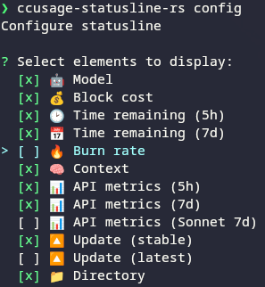

# ccusage-statusline-rs


A Claude Code statusline: reconstructs usage from local transcripts, merges it with the
claude.ai usage endpoint, and renders one line — cost, billing block, burn rate, context,
and rate-limit windows.

## Install

| Method | Command |
|---|---|
| cargo | `cargo install ccusage-statusline-rs` |
| binstall | `cargo binstall ccusage-statusline-rs` |
| Arch (AUR) | `paru -S ccusage-statusline-rs` or `ccusage-statusline-rs-bin` |
| Homebrew | `brew install ticpu/tap/ccusage-statusline-rs` |
| Nix | `nix run github:ticpu/ccusage-statusline-rs?dir=packaging/nix` |
| Binary | download from [releases](https://github.com/ticpu/ccusage-statusline-rs/releases/latest) |
| Source | `cargo build --release` |

Then wire it into Claude Code:

```bash
ccusage-statusline-rs install
```

That writes the `statusLine` entry in `~/.claude/settings.json`; `uninstall` removes it.
Restart Claude Code afterwards.

The Linux binaries are statically linked against musl, so one binary runs on any glibc or
musl distribution with no libc dependency.

## Multi-account isolation

`CLAUDE_CONFIG_DIR` switches accounts, and every path follows it — credentials, settings,
transcripts, this tool's own config, and the runtime cache:

```bash
export CLAUDE_CONFIG_DIR=~/.claude-personal
ccusage-statusline-rs install
```

Each config directory gets its own cache scope, keyed on the directory name, so a work and
a personal account never read each other's cached output or usage figures. Unset, it falls
back to `~/.claude`.

> Two config directories whose *basenames* match (`~/a/.claude` and `~/b/.claude`) share one
> cache scope. Give them distinct names.

## Windows

Claude Code invokes the statusLine command through Git Bash, which cannot execute a Windows
path written with backslashes or an extended-length prefix. The `install` subcommand
normalizes the path to forward slashes, and refuses outright — with the reason — when the
binary sits behind a UNC or verbatim prefix that Git Bash could never run.

Configuring the path by hand means reproducing that: use `C:/Users/you/.local/bin/ccusage-statusline-rs.exe`,
never backslashes, or the statusline silently fails to appear.

## Configuration

```bash
ccusage-statusline-rs config
```



An interactive menu toggles individual elements, picks the update-notification channel
(stable/latest/off), and sets burn-rate and context color thresholds. Settings live in
`ccusage-statusline-config.json` inside the config directory.

Cache timing is edited in that file directly:

```json
{
  "cache": {
    "output_cache_secs": 300,
    "api_fresh_secs": 300,
    "api_stale_secs": 1800
  }
}
```

- `output_cache_secs` — how long to reuse cached statusline output
- `api_fresh_secs` — minimum interval between API requests
- `api_stale_secs` — show an error after this long without a successful API response

### Manual configuration

```json
{
  "statusLine": {
    "type": "command",
    "command": "/path/to/ccusage-statusline-rs"
  }
}
```

## Features

- Live 5-hour and 7-day utilization via Claude Code's OAuth token
- 5-hour billing blocks matching Claude's cycles, deduplicated across duplicate JSONL entries
- Burn rate, and how long you can keep coding at the current rate
- Context tokens with threshold coloring
- Cost from LiteLLM's daily price table, including tiered pricing
- Claude Code update notifications

## Performance

Renders in about 8ms warm, with a 20ms average budget asserted by the test suite.
Transcripts are parsed incrementally — each render reads only the bytes appended since the
last one, so cost stays flat as sessions grow.

Set `CCUSAGE_TIMING=1` for per-phase wall time on stderr:

```bash
CCUSAGE_TIMING=1 ccusage-statusline-rs test 2>&1 >/dev/null
```

`block.read` reports bytes parsed alongside entries produced, which distinguishes a slow
phase from one handed too much work.

## Inspiration

A Rust reimplementation of the statusline from
[ccusage](https://github.com/ryoppippi/ccusage) by ryoppippi, whose TypeScript version
provided the architecture and pricing logic.

## License

MIT — see LICENSE.
